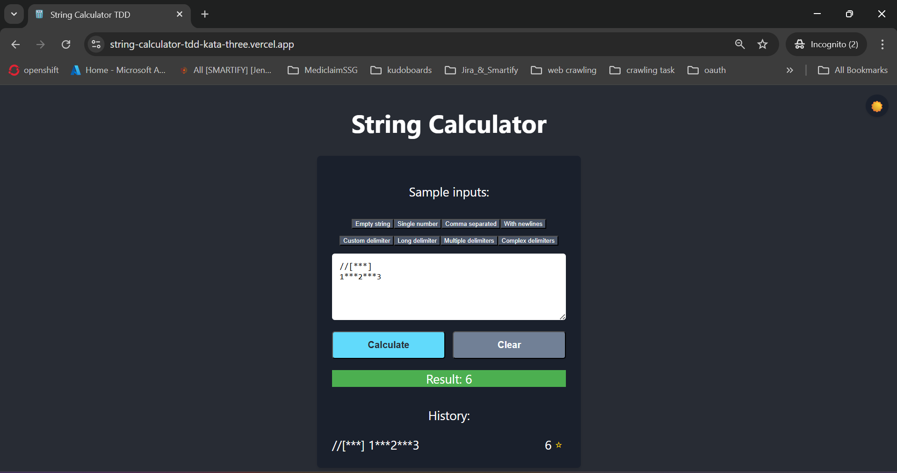

<h1 align="center">🧮 String Calculator - TDD Kata</h1>

<p align="center">
  <a href="https://string-calculator-tdd-kata-three.vercel.app/"><strong>Live Demo</strong></a>   •   
  <a href="https://contact-form-react-sepia.vercel.app/"><strong>Contact Me</strong></a>
</p>

<p align="center">
  
  
  
  
  
  
  
</p>

**String Calculator TDD Kata** is a React + TypeScript implementation of the classic String Calculator exercise using **Test-Driven Development**.  
Each enhancement is introduced via a failing test ➡️ implementation ➡️ refactoring ➡️ commit.

---

## ✨ Features:

- ✅ Add empty string `""` ➝ returns `0`
- ✅ Add single number `"1"` ➝ returns `1`
- ✅ Add two numbers `"1,2"` ➝ returns `3`
- ✅ Add unknown number of values `"1,2,3,4"` ➝ returns `10`
- ✅ Support newline delimiters `"1\n2,3"` ➝ returns `6`
- ✅ Custom delimiter `"//;\n1;2"` ➝ returns `3`
- ✅ Handle invalid input `"1,\n"` ➝ returns error (optional)
- ✅ Throw error for negatives `"1,-2"` ➝ `negatives not allowed: -2`
- ✅ Multiple negatives ➝ `negatives not allowed: -1,-3`
- ✅ Ignore numbers > 1000 ➝ `"2,1001"` ➝ returns `2`
- ✅ Delimiters of any length `"//[***]\n1***2***3"` ➝ returns `6`
- ✅ Multiple delimiters `"//[*][%]\n1*2%3"` ➝ returns `6`
- ✅ Multiple long delimiters `"//[***][##]\n1***2##3"` ➝ returns `6`

---

## 🧪 Tech Stack:

| Tech           | Description                  |
|----------------|------------------------------|
| React          | Frontend Library             |
| TypeScript     | Static Typing                |
| Jest           | Testing Framework            |
| TDD            | Red → Green → Refactor cycle |

---

## 📁 Project Structure:

```plaintext
src/
├── calculator/
│   ├── stringCalculator.ts        // Core logic
│   └── stringCalculator.test.ts   // Unit tests (Jest)
├── App.tsx
└── ...
```

---

## 🧠 TDD Workflow:

> Followed the classical TDD cycle:
1. 🔴 Write a failing test
2. 🟢 Make it pass
3. 🧹 Refactor the code
4. 💾 Commit the changes

Every commit in this repo corresponds to a **single, passing test**.

---

## 💡 Kata Guidelines:

- Start with the simplest test case (empty string)
- Add functionality incrementally with tests first
- Refactor after **every** passing test
- Keep code clean and expressive
- Handle all edge cases via unit tests

---

## 🛠 Requirements:

- Node.js ≥ 18.x
- npm or Yarn
- React ≥ 18.x
- TypeScript ≥ 5.x
- Jest for testing

---

## ▶️ Getting Started:

To run this project locally:

```bash
    git clone https://github.com/deepanshubajaj/String-Calculator-TDD-Kata.git
```
```bash
    npm install
```
```bash
    npm test     # For test cases
```
```bash
    npm start   # For production build 
```

---

### 🖼️ Icon:

<p align="center">
  
</p>

<p align="center">
  *This is the App Icon.*
</p>

---

## 🎨 Steps & Test:

Also refer [here](https://blog.incubyte.co/blog/tdd-assessment/) & [here](https://osherove.com/tdd-kata-1/).

<p align="center">
  
</p>

<p align="center">
  *Add empty string `""` ➝ returns `0`*
</p>

<p align="center">
  
</p>

<p align="center">
  *Add single number `"1"` ➝ returns `1`*
</p>

<p align="center">
  
</p>

<p align="center">
  *Add two numbers `"1,2"` ➝ returns `3`*
</p>

<p align="center">
  
</p>

<p align="center">
  *Add unknown number of values `"1,2,3,4"` ➝ returns `10`*
</p>

<p align="center">
  
</p>

<p align="center">
  *Support newline delimiters `"1\n2,3"` ➝ returns `6`*
</p>

<p align="center">
  
</p>

<p align="center">
  *Custom delimiter `"//;\n1;2"` ➝ returns `3`*
</p>

<p align="center">
  
</p>

<p align="center">
  *Handle invalid input `"1,\n"` ➝ returns error (optional)*
</p>

<p align="center">
  
</p>

<p align="center">
  *Throw error for negatives `"1,-2"` ➝ `negatives not allowed: -2`*
</p>

<p align="center">
  
</p>

<p align="center">
  *Multiple negatives ➝ `negatives not allowed: -1,-3`*
</p>

<p align="center">
  
</p>

<p align="center">
  *Ignore numbers > 1000 ➝ `"2,1001"` ➝ returns `2`*
</p>
<p align="center">
  *Delimiters of any length `"//[***]\n1***2***3"` ➝ returns `6`*
</p>
<p align="center">
  *Multiple delimiters `"//[*][%]\n1*2%3"` ➝ returns `6`*
</p>
<p align="center">
  *Multiple long delimiters `"//[***][##]\n1***2##3"` ➝ returns `6`*
</p>

---

## 🖼️ Screenshots:

Snapshots representing each mentioned step above:

<p align="center">
  
</p>

<p align="center">
  
</p>

<p align="center">
  
</p>

<p align="center">
  
</p>

<p align="center">
  
</p>

<p align="center">
  
</p>

<p align="center">
  
</p>

<p align="center">
  
</p>

<p align="center">
  
</p>

<p align="center">
  *Screenshots in Dark Theme*
</p>

##

<p align="center">
  
</p>

<p align="center">
  
</p>

<p align="center">
  
</p>

<p align="center">
  
</p>

<p align="center">
  
</p>

<p align="center">
  
</p>

<p align="center">
  
</p>

<p align="center">
  
</p>

<p align="center">
  
</p>

<p align="center">
  *Screenshots in Light Theme*
</p>

---

## 🚀 Video Demo:

Here’s a short video showcasing the app's functionality in Dark & Bright Mode:

[Watch the Working Demo - Dark Theme](https://github.com/user-attachments/assets/ef4a97bf-8464-4c99-8461-f9c3a49e0277)

##

[Watch the Working Demo - Light Theme](https://github.com/user-attachments/assets/0f8addae-f9cb-468a-9351-3f660009efc0)

##

➤ <a href="ProjectOutputs/WorkingVideo/DT.mp4">🎥 Watch Working Video 1 - [Dark Mode]</a>

➤ <a href="ProjectOutputs/WorkingVideo/LT.mp4">🎥 Watch Working Video 2 - [Light Mode]</a>

---

## 🤝 Contributing:

Thank you for your interest in contributing to this project!  
I welcome contributions from the community.

- You are free to use, modify, and redistribute this code under the terms of the **MIT License**.
- If you'd like to contribute, please **open an issue** or **submit a pull request**.
- All contributions will be reviewed and approved by the author — **[Deepanshu Bajaj](https://github.com/deepanshubajaj?tab=overview&from=2025-03-01&to=2025-03-31)**.

---

### 📌 How to Contribute:

To contribute:

1. Fork the repository.

2. Create a new branch:
   ```bash
    git checkout -b feature/your-feature-name
   ```

3. Commit your changes:
   ```bash
    git commit -m 'Add your feature'
   ```

4. Push to the branch:
   ```bash
    git push origin feature/your-feature-name
   ```

5. Open a pull request.

---

## 📃 License:

This project is licensed under the [MIT License](./LICENSE).  
You are free to use this project for personal, educational, or commercial purposes — just make sure to provide proper attribution.

> **Clarification:** Commercial use includes, but is not limited to, use in products,  
> services, or activities intended to generate revenue, directly or indirectly.

---

## 📩 Contact:

You can reach out to me [here](https://contact-form-react-sepia.vercel.app/).
